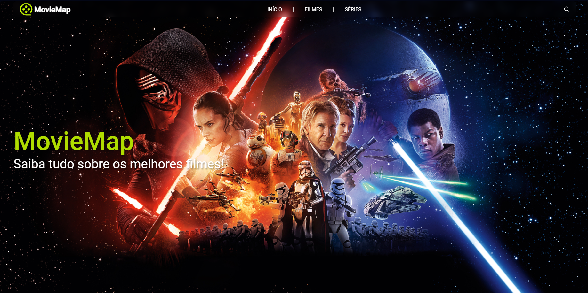

# MovieMap

Este projeto foi apenas na inspiração rs. Inicialmente estava navegando na web e vi algumas ideias de projeto, dentre elas uma sugestão de utilização da API The Movie DB. Diante disso, fui pesquisar mais a fundo sobre essa API e sobre quais recursos ela disponibiliza, e pra ser bem sincero, acabei me impressionando com tamanha facilidade e extrema qualidade dos dados. Já com um conhecimento básico nessa API, montei um layout e comecei a reproduzi-lo. No fim das contas, o projeto ficou bem bacana, possibilitando pesquisar, navegar por paginação, ver detalhes e até trailers.

## Rodando os testes

Para rodar os testes, faça o seguinte:

- Clone ou baixe o repositório em sua máquina
- Entre na pasta raiz do projeto e instale as dependências com `npm install`
- Crie uma arquivo chamado `.env` e neste arquivo configure o parâmetro citados abaixo
- Após realizar a configuração do `.env`, basta rodar o projeto com `npm run dev | yarn dev | pnpm dev`

| Parâmetro   | Descrição                           |
| :---------- | :---------------------------------- |
| `VITE_TOKEN` |**Obrigatório**, Token Gerado no [The Movie DB](https://developer.themoviedb.org/docs)
| `VITE_URL_MOVIE` | `string` | **Obrigatório**. Defina `https://api.themoviedb.org/3` 
| `VITE_IMG` | `string` | **Obrigatório**. Defina `https://image.tmdb.org/t/p/w500/` 
| `VITE_IMG_DETAILS` | `string` | **Obrigatório**. Defina `https://image.tmdb.org/t/p/original` 

## Demonstração

- [Visualizar o projeto](https://moviemap.vercel.app)

## Stack utilizada

- [Typescript](https://www.typescriptlang.org)
- [Frame Motion](www.framer.com/motion)
- [React Icons](https://lucide.dev/icons/)
- [React Paginate](https://www.npmjs.com/package/react-paginate)
- [React Tooltip](https://www.npmjs.com/package/react-tooltip)

## Etiquetas

